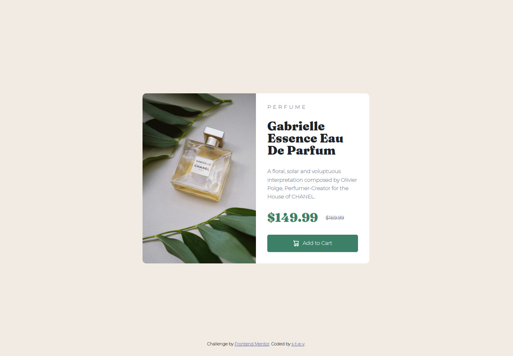
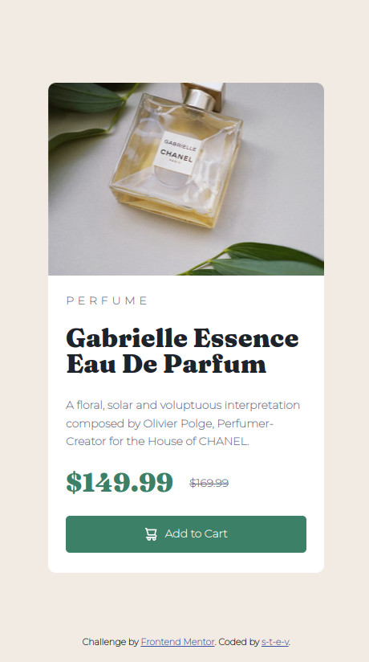
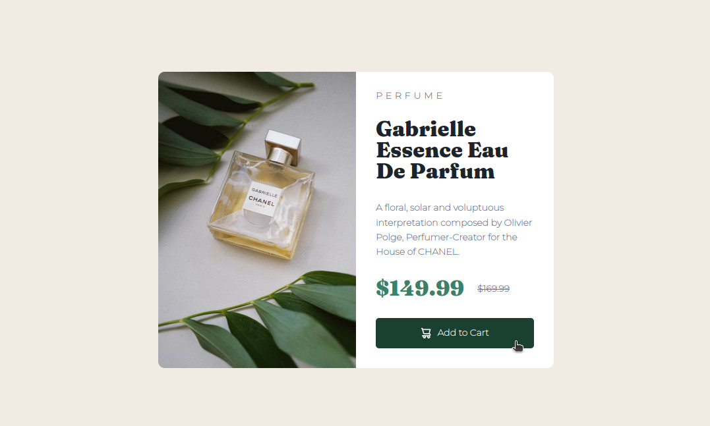

# Frontend Mentor - Product preview card component solution

This is a solution to the [Product preview card component challenge on Frontend Mentor](https://www.frontendmentor.io/challenges/product-preview-card-component-GO7UmttRfa). Frontend Mentor challenges help you improve your coding skills by building realistic projects. 

## Table of contents

- [Overview](#overview)
  - [The challenge](#the-challenge)
  - [Screenshots](#screenshots)
  - [Links](#links)
- [My process](#my-process)
  - [Built with](#built-with)
  - [What I learned](#what-i-learned)
  - [Continued development](#continued-development)
  - [Useful resources](#useful-resources)
- [Author](#author)

## Overview

### The challenge

Users should be able to:

- View the optimal layout depending on their device's screen size
- See hover and focus states for interactive elements

### Screenshots

**Normal state**



**Small screen state**



**Button in hovering state**



### Links

- Solution URL: [Github Project](https://github.com/s-t-e-v/Product-preview-card-component)
- Live Site URL: [Github Web page](https://s-t-e-v.github.io/Product-preview-card-component)

## My process

### Built with

- Semantic HTML5 markup
- CSS3 custom properties
- Flexbox
- [Design files to download](https://www.frontendmentor.io/challenges/product-preview-card-component-GO7UmttRfa/hub/product-preview-card-component-aNIJgOsOaS) - For styles

### What I learned

Below are the major things I learned throughout this project.

#### Centering with flex + margin: auto

I don't know why I was skeptical about with this way of doing, but it's simple and very efficient:

```css
body {
	/*some code above*/
    
    display: flex;
}
```

```css
#page {
   /*some code above*/

    margin: auto;
    
    /*some code bellow*/
}
```

With this, `#page` and all of what it contains is centered horizontally and vertically

It also helped to easily bottom center `.attribution`. Before that I was using a combination of `display: flex` + `justify-content: center` + `align-items: center` in `body`, which complicated `.attribution` bottom centering.

#### Equally space elements in a box while maintaining all of them inside

The combo of flexbox + box-sizing was what enabled me to achieve the intended result:

**Box-sizing**:

```css
#product {
    background-color: hsl(0, 0%, 100%);
    border-radius: 0 10px 10px 0;
    box-sizing: border-box;
    display: flex;
    justify-content: center;
    align-items: center;
}
```

**Flexbox**:

```css
#prod_container {
    width: 240px;
    height: 390px;

    margin: 0;
    padding: 0;
   
    display: flex;
    flex-direction: column;
    justify-content: space-between;
}
```

`#prod_container` contains the text describing the product and the "add to cart" button.

`#product` contains `#prod_container`, gives the frame shape and background color.

`#product` has actually a 300px width size. `border-sizing` set to *border-box* makes the elements inside `#prod_container` not overflowing. And in `#prod_container`, the property `justify-content` is set to *space-between*, so elements are equally spaced between each other.


#### Paragraphs, headers with no space around

I had issues with paragraphs and headers inside `#prod_container`, because by default, there is some space around these two types of HTML elements. Writing the bellow in the CSS code resolved the issue:

```css
#prod_container p, h1 {Paragraphs, headers with no space around
    padding: 0;
    margin: 0;
}
```

In the future, I will use that trick or a better one.

#### Making a button linking to a URL

I found it impressive how a HTML link tag can be transformed into a button. Over here is how I designed the button:

```css
a {
    display: block;
    
    color: hsl(0, 0%, 100%);
    background-color: hsl(158, 36%, 37%);
    
    text-align: center;
    text-decoration: none;
    border-radius: 5px;
    font-weight: bold;

    padding: 15px;
}
```

To do so, it was important to:

- convert the tag from inline to block element via the `display` property.
- set `text-decoration` to *none*

with this, no underline is displayed with the link. And I can make it behaves like the other elements in `#prod_container` which are all block type and set its appearance to a button with `border-radius`, `background-color`, etc.

#### Set the image size to the background one

```css
#product_img {
	background-image: url("images/image-product-mobile.jpg");
	background-size: 100% 100%;
}
```

The `background-size` line is the code that make it works. Otherwise, we just see a part of the image if the later is too large compare to its container.

#### Media queries for all type of devices and smartphone

I learned how to use media queries, so the website displayed the optimal layout depending of the screen size, whether it is on pc or smartphone.

```css
@media all and (max-width: 600px), all and (max-device-width: 480px) {
	...
}
```

Inside, I just have to rewrite how HTML elements display within the `@media` block. Not all the CSS code. Just the ones that needed to change when the width screen is so small that we have to scroll horizontally. No need to rewrite everything.

#### Using GIMP to determine the size of elements

GIMP helped me a lot in determining the size of elements. Thankfully I had very basic knowledge about that software.

#### Using different fonts to beautify a Website

I haven't realized until doing this project how fonts are a game changer in web design, and design in general. I am used to write reports, etc. with Time New Roman or equivalent fonts, and this by applying only one to the document. Good to know that for future web design projects.

#### Commenting in CSS
Very basic skill, but I learned to do it during the project. 

```css
/*comments*/
```

It is good to read/watch courses on how to comment, but you really learn to do it **when** you actually do it.

### Continued development

In future projects, I would like to focus one at least one of these areas:

- Drafting README file while doing the project. Saving useful links during the coding process. So I don't have to struggle recalling the hows and whys.
- Commenting my CSS code, so I can understand my code when I return to it several days later.
- Using flexbox with more elegance
- Using Git/Github in a more efficient. Especially by using branches.
- Custom fonts integration: I feel like I am not in full control of font-weight, font-size, and also of how it is displayed in different browsers.
- Mastering other layout method (`position: absolute`, `relative`; inline-block, etc.). Because sometimes I feel flexbox doesn't give all the flexibility I want during my design process.
- Understanding more about how text, block, etc. are structured and designed. So I can better arrange elements.
- Structuring HTML file more efficiently: no useless "id", "class", "div". Also better choice in tags. I feel the structure of my HTML isn't optimal.
- Writing lesser amount of CSS code
- Using media queries to be comfortable with.

### Useful resources

The resources bellow gave me the necessary knowledge to complete this project:
- Google search "comment css": A quick search on Google helped to remember how to comment in CSS.
- [Stackoverflow - CSS media queries: max-width OR max-height](https://stackoverflow.com/questions/11404744/css-media-queries-max-width-or-max-height)): This Stackoverflow Q&A helped me to figure out how to combine media queries with "OR" conditions using the good syntax.
- [Logic in CSS Media Queries (If / Else / And / Or / Not) ](https://css-tricks.com/logic-in-css-media-queries/): This helped me, in the sense that it confirmed to me that it was possible to make "OR" conditions with media queries.
- [Body height 100% displaying vertical scrollbar](https://stackoverflow.com/questions/12989931/body-height-100-displaying-vertical-scrollbar): This Q&A helped me to get rid of the scrollbar displayed when body height is set to 100%. I discovered the impact of `<html>` and `<body>` tags on these issues. 
- [Webfont Generator](https://www.fontsquirrel.com/tools/webfont-generator): This website is very good to generate all formats of web font to ensure compatibility with browsers.
- [Stackoverflow - Vertically align text next to an image?](https://stackoverflow.com/questions/489340/vertically-align-text-next-to-an-image#:~:text=Using%20flex%20property%20in%20css,justify%2Dcontent%3Acenter%3B%20): It helped me to vertically align the "Add to cart" text to the cart logo.
- [letter-spacing](https://developer.mozilla.org/en-US/docs/Web/CSS/letter-spacing): This web page was the reason I succeeded to letter-space the "PERFUME" header.
- [Openclassroms - HTML5/CSS3 course](https://openclassrooms.com/fr/courses/1603881-apprenez-a-creer-votre-site-web-avec-html5-et-css3): All the fundamentals of HTML/CSS page building, especially Flexbox, I acquired them from this wonderful website. This course is in French, but some others are in English. I really recommend, well written.
- [CSS Outside Border](https://stackoverflow.com/questions/9102900/css-outside-border): This Stackoverflow Q&A helped me to understand the effect of borders on box size in CSS.
- [CSS padding overrides overflow?](https://stackoverflow.com/questions/19051411/css-padding-overrides-overflow): TThis Stackoverflow Q&A was **key** to complete the project. He helped me to tame the flex items in a box, so it stays inside instead of overflowing, thanks to the CSS code `box-sizing: border-box`.
- [Better way to set distance between flexbox items](https://stackoverflow.com/questions/20626685/better-way-to-set-distance-between-flexbox-items): This encourages me to use "gap" property to put space between flex items.
- [“position absolute bottom center” Code Answer’s](https://www.codegrepper.com/code-examples/css/position+absolute+bottom+center): Helped me to bottom center the *attribution* `<div>`.

## Author

- Github - [s-t-e-v](https://github.com/s-t-e-v)
- Frontend Mentor - [@s-t-e-v](https://www.frontendmentor.io/profile/s-t-e-v)
